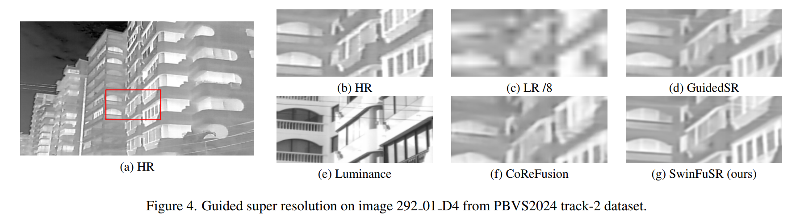
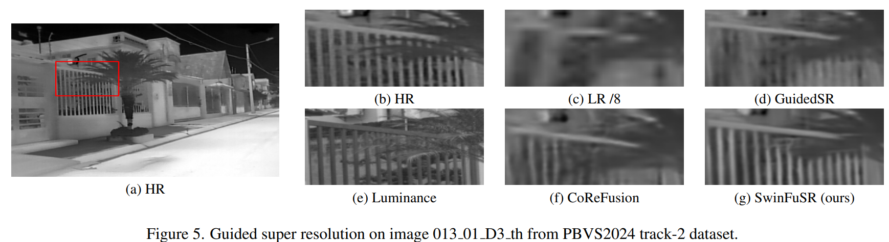
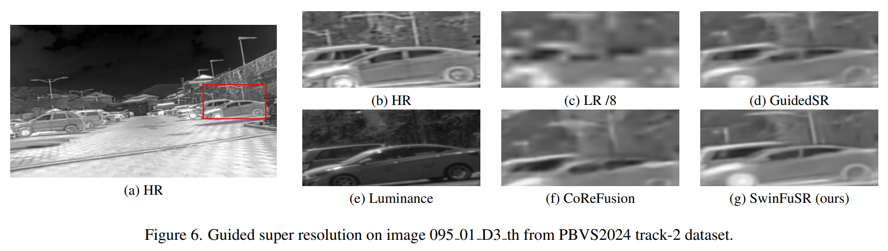
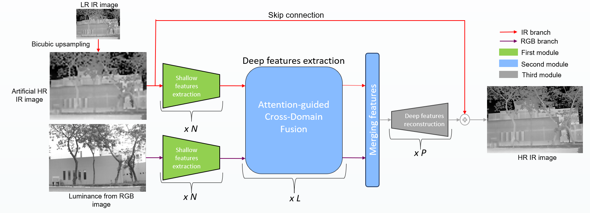

# SwinFuSR
SwinFuSR: an image fusion inspired model for RGB-guided thermal image super-resolution 
## ✨ Guided thermal super resolution Examples ✨
Some examples of guided resolution on images from PBVS24 track-2 dataset.





## 🚀 Set up 
```
conda create --name SwinFuSR pytorch torchvision pytorch-cuda=11.7 -cpytorch -c nvidia
conda activate SwinFuSR
pip install -r requirements.txt
```

## 🤖 Architecture 
The proposed architecture is


## ⚙️ Training 
Register to the competition to access the [**PBVS dataset**](https://codalab.lisn.upsaclay.fr/competitions/17014#participate), and update **dataroot_lr/dataroot_guide/dataroot_gt path** in the json file.

For training on the small network for x8 guided super resolution(944,491 parameters, trainable with one RTX 3080 12GB):

    python main_train_SwinFuSR.py --opt options/train_baseline.json

For training on the large network for x8 guided super resolution(3.3 M parameters, trainable with two V100 32GB):

    python main_train_SwinFuSR.py --opt options/train_final.json

For training with robustness to the missing modality for x8 guided super resolution (proba_without_rgb=0.3) on the small network:

    python main_train_SwinFuSR.py --opt options/train_modality_augmentation.json

For training on the small network for x16 guided super resolution(944,491 parameters, trainable with one RTX 3080 12GB):

    python main_train_SwinFuSR.py --opt options/train_x16.json

## 🖋️ Fine-tuning 

For fine-tuning the network with pre-trained weights, you can download them from the release section. Modify in the json file the argument **path/pretrained_netG** with the path where you put the weights. Then if you want fine tune for example with the baseline pretrained network, you can run:

    python main_train_SwinFuSR.py --opt options/train_baseline_finetune.json

## 👌 Testing 
For testing, the json should be the same as the one you used for training the network you want to use. Specify in the argument **path/pretrained_netG** with the path where the weights of the network you want to use are.

Then if you want to test the network with ground truth image and compute metrics with, set **without_GT** to true and add the path of your dataset on **datasets/validation/dataroot_lr,dataroot_guide,dataroot_gt**. 

if there is no GT, set **without_GT** to false and add the path of your dataset on **datasets/test/dataroot_lr,dataroot_guide,dataroot_gt**

For example, for testing on test set of the challenge:

    python test_SwinFuSR.py --opt options/test_swinFuSR.json


## 🕵️ Arguments 
Argument scripts are described in a json file and are described in the table below
|Argument|<div style="width:490px">Description</div>| <div style="width:'00px">Example</div>|
|:-:|:-----:|:-:|
| task | describe the task to be performed | Guided SR (do not modify) |
| model | describe the framework ( gan for example) | plain  (do not modify)       |
| gpu_ids  | the id of the GPUs to be used, and will automatically distribute the data to the various GPUs        | [0] if only one GPU               |
| dist  | boolean which describe if data will be distributed           | true               |
| scale     | Scale to perform super resolution | 8         |
| wandb | boolean if you want monitor with wandb your run | true             |
| n_channels_guide    | number of channels of the guide image | 3             |
| path/root |    path where all files will be saved | Model/SR_competition24_baseline |
|  path/images | path where all images will be saved  | Model/SR_competition24_baseline/images      |
|  dataset/dataroot_lr | path of folder for lr images  | path_challenge/ChallengePBVS24/thermal/train/LR_x8/images      |
|  dataset/dataroot_guide | path of folder for guide images  | path_challenge/ChallengePBVS24/visible/train/      |
|  dataset/dataroot_gt | path of folder for gt images  |   path_challenge/ChallengePBVS24/thermal/train/GT/   |
|  dataset/train/patch | if true, use patches rather than the entire image |   true  |
|  dataset/train/H_size | patch size, patch argument must me true  |   64  |
|  dataset/train/proba_without_rgb | probability to drop guide image  |   0.0 [0:1]  |
|  dataset/dataloader_shuffle | boolean to iterate randomly over images  |   true  |
|  dataset/dataloader_num_workers |number of workers to load images |   8  |
|  netG/net_type |name of the network|   swinfusionSR (do not modify)  |
|  netG/upscale |upsale of the network|   1 (do not modify )  |
|  netG/in_chans |number of channel images |   1  |
|  netG/img_size | input image size |   64  |
|  netG/window_size |Size of windows dividing the image|   8  |
|  netG/img_range |pixel value range|   1.0  |
|  netG/embed_dim |patch embedding dimension (early convolutions)|   60 |
|  netG/(Ex/fusion/Re_depths) |extraction/fusion/reconstruction  layer depth|   [2,2] -> 2 x Attention-guided Cross-domain Fusion block |
|  netG/(Ex/Fusion/Re_heads) |head number Extraction/Fusion/reconstruction  layers|   [6, 6] -> 2 x Attention-guided Cross-domain Fusion block with 6 heads |
|  netG/mlp_ratio |ratio of mlp hidden dim to embedding dim| 2|
|  upsampler |the reconstruction reconstruction module. | null if upscale=1 or 'pixelshuffle' or 'pixelshuffledirect' or 'nearest+conv'|
|  resi_connection |the convolutional block before residual connection. | '1conv','3conv' |
|  init_type |weight initialization type |  'default','normal','uniform','xavier_normal','xavier_uniform'|
|  train/batch_size |batch size |  16|
|  train/G_lossfn_type |type of Loss, keep 'mixed' for a weighting of several losses  |  'mixed','l1','l2','l2sum'|
|  train/weights |weighting values for different losses |  \{"l1":  1.0,"mse": 0.0,"ssim": 0.0,"psnr": 0.0,"contrast": 0.0,"lpips": 0.0,"adversarial": 0.0}|
|  train/manual_seed |fixed seed for random number generation  |60  |
|  train/G_optimizer_lr | learning rate |4e-4  |
|  train/G_optimizer_clipgrad | value for Clip the gradient norm |null  |
|  train/G_optimizer_reuse | boolean for reuse parameters from the optimizer  |true  |
|  train/G_scheduler_type | type of learning rate scheduler |MultiStepLR (do not change)  |
|  train/G_scheduler_milestones | list of epoch indices. Must be increasing |\[150000,250000]|
|  train/G_scheduler_gamma | Multiplicative factor of learning rate decay |0.5|
|  train/G_regularizer_orthstep | step for apply SVD Orthogonal Regularization on every layers |null|
|  train/G_regularizer_clipstep | step to clip weights of the network|null|
|  train/G_param_strict | boolean parameter of the pytorch load_network|true|
|  train/checkpoint_test | every checkpoint_test step, compute metrics on the validation set|20000|
|  train/checkpoint_print | every checkpoint_print step, compute metrics on the training set|50|
|  train/limit_test | limit number of images to be generated from test set|150|
|  train/limit_validation | limit number of images to evaluate from validation set|1150|
|  train/epochs | epoch number to train the model|30000|

## 🤝 Acknowledgement 
The codes are heavily based on [SwinFusion](https://github.com/Linfeng-Tang/SwinFusion) and a little by [CoReFusion](https://github.com/Kasliwal17/CoReFusion).  Thanks for their inspiring works.
